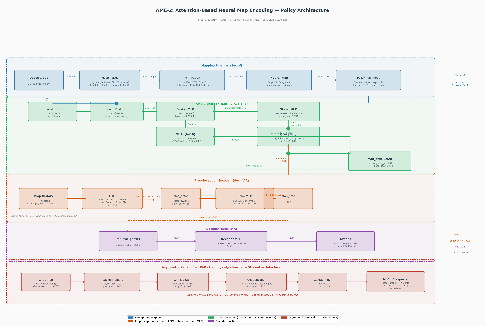

# AME-2: Attention-Based Neural Map Encoding for Legged Locomotion

Standalone implementation of **AME-2** — a three-phase teacher-student RL pipeline for agile and
generalized legged locomotion, reproducing the paper:

> Chong Zhang, Victor Klemm, Fan Yang, Marco Hutter (ETH Zurich RSL)
> "AME-2: Agile and Generalized Legged Locomotion via Attention-Based Neural Map Encoding"
> arXiv:2601.08485

Tested on **ANYmal-D** (quadruped). TRON1 biped configs included but not validated.

---

## Repository Structure

```
ame2/                       # Installable Python package (pip install -e .)
├── __init__.py             # Gymnasium env registration (requires Isaac Lab)
├── ame2_env_cfg.py         # ManagerBasedRLEnv config: obs, rewards, terrains, curriculum
├── rewards.py              # 14 reward functions (Table I, Eq.1–5)
├── terrains.py             # 12 training + 4 evaluation terrain configs
├── curriculums.py          # Goal-reaching terrain curriculum + heading curriculum
├── networks/
│   ├── ame2_model.py       # Pure PyTorch: MappingNet, WTAMapFusion, AME2Policy,
│   │                       #   AsymmetricCritic, StudentLoss, LSIO (no Isaac Lab needed)
│   └── rslrl_wrapper.py    # RSL-RL wrappers: AME2ActorCritic, AME2StudentActorCritic,
│                           #   WTAMapManager, AME2MapEnvWrapper (domain randomization)
└── agents/
    └── rsl_rl_cfg.py       # PPO / distillation runner configs (Table VI hyperparams)

scripts/
├── train_ame2.py           # Three-phase training launcher (Phase 0/1/2)
├── train_mapping.py        # Phase 0: MappingNet standalone pretraining (no Isaac Sim)
└── test_ame2.py            # Unit tests — all 19 pass without Isaac Sim

paper/
├── AME2-Attention-Neural-Map.pdf   # gitignored (45 MB) — download from arXiv
└── AME2/                           # MinerU-parsed paper (markdown + figures)
```

---

## Architecture Overview



> Regenerate with: `python scripts/draw_architecture.py`

**Color coding:** Blue = Perception/Mapping · Orange = Proprioception · Green = AME-2 Encoder · Purple = Decoder · Red = Critic (training only) · Dashed = Teacher-only path

---

## Training Pipeline

```
Phase 0 ── Pretrain MappingNet (no Isaac Sim, ~1 hr on GPU)
    │         β-NLL loss (Eq.9) + TV reweighting (Eq.10)
    │         Synthetic terrains + noise augmentation
    ▼
Phase 1 ── Teacher PPO  (80 000 iter, needs Isaac Sim)
    │         GT elevation map + full proprioception
    │         Entropy coef: 0.004 → 0.001 (linear decay)
    │         Perception noise curriculum: 0 → max (first 20%)
    │         Heading curriculum: face-goal → random yaw (first 20%)
    ▼
Phase 2 ── Student Distillation + PPO  (40 000 iter, needs Isaac Sim)
              First 5 000 iter: pure distillation (PPO disabled), LR = 1e-3
              Next  35 000 iter: PPO + distillation,              LR = 1e-4
              Loss: L = L_PPO + 0.02 L_distill + 0.2 L_repr
              Domain randomization: scan degradation + map corruption + drift
```

---

## Quick Start

### 1. Install

```bash
# Core (no Isaac Sim): PyTorch + tensordict only
pip install -e .

# Full training (requires Isaac Sim 4.x + Isaac Lab + robot_lab)
# See: https://isaac-sim.github.io/IsaacLab/
# pip install -e source/robot_lab   (from fan-ziqi/robot_lab repo)
```

### 2. Run unit tests (no Isaac Sim required)

```bash
# 19 tests covering: MappingNet, WTAMapFusion, LSIO, AME2Encoder,
#   StudentLoss, AsymmetricCritic, AME2ActorCritic L-R symmetry
pytest scripts/test_ame2.py -v
```

### 3. Phase 0 — Pretrain MappingNet (no Isaac Sim)

```bash
python scripts/train_ame2.py --phase 0
# Saves: logs/mapping_net.pt  (~1 hr on GPU, 50k steps recommended)
# Or use the dedicated script with full control:
python scripts/train_mapping.py --num_steps 50000 --batch_size 64
```

### 4. Phase 1 — Teacher PPO (needs Isaac Sim)

```bash
python scripts/train_ame2.py --phase 1 --num_envs 4800 \
    --mapping_ckpt logs/mapping_net.pt
# 80 000 iterations, ~60 RTX-4090-days (8 GPUs)
```

### 5. Phase 2 — Student Distillation + PPO (needs Isaac Sim)

```bash
python scripts/train_ame2.py --phase 2 \
    --teacher_ckpt logs/ame2_teacher_<timestamp>/model_80000.pt
# 40 000 iterations (5k pure distillation + 35k PPO)
```

### 6. One-command full pipeline

```bash
bash scripts/train_all.sh                      # full scale (8× RTX-4090)
bash scripts/train_all.sh --num_envs 512       # single-GPU debug
```

> **Full parameter guide:** [docs/training_walkthrough.md](docs/training_walkthrough.md)

---

## Key Design Details

### Probabilistic WTA Map Fusion (Sec.V, Eq.6–8)

The global map is updated stochastically — **not** deterministically:

```
σ̂²_t  = max(σ²_t, 0.5·σ²_prior)              # Eq.6: lower-bound by prior
valid  = (σ̂²_t < 1.5·σ²_prior) OR (σ̂²_t < 0.04)  # validity gate
p_win  = (1/σ̂²_t) / (1/σ̂²_t + 1/σ²_prior)    # Eq.7: precision-weighted prob
update = sample ξ ~ U[0,1];  overwrite if ξ < p_win   # Eq.8: stochastic
```

With typical observation variance, p_win ≈ 0.67 (not 1.0). This prevents
over-confident predictions from permanently taking over occluded cells.

### Student Proprioception: LSIO (Sec.IV-A)

```
History per step (42D): ang_vel(3) + gravity(3) + q(12) + dq(12) + actions(12)
              ↓ stacked T=20 steps
Short branch: last 4 steps flattened → 168D
Long  branch: 1D CNN [Conv(42→32,k=6,s=3) + Conv(32→16,k=4,s=2)] → 16D
LSIO output: 184D  →  cat(cmd 3D)  →  MLP  →  prop_emb (128D)
```

Base linear velocity is excluded from history (noisy on real hardware) and
fed only to the teacher.

### Domain Randomization API (Sec.IV-D.3, Appendix B)

All values below are **stated** in Appendix B of the paper.

Configure on `AME2MapEnvWrapper`:

```python
# Phase 1: perception noise curriculum
env.set_scan_noise_scale(scale)          # 0.0 → 1.0 over first 20% of iters
                                         # max std = 0.05 m [stated, Appendix B]

# Phase 2: student-specific degradation  (called automatically in train_ame2.py)
env.set_student_scan_degradation(
    dropout_rate=0.15,   # [stated] 15% of depth points missing
    artifact_rate=0.02,  # [stated] 2% artifact (random) points
    artifact_std=0.5,    # [inferred] spike magnitude
)
env.set_map_randomization(
    partial_fraction=0.90,  # [stated] 90% envs local-only (10% complete)
    drop_fraction=0.01,     # [stated] 1% of map cells corrupted each step
    drift_max_m=0.03,       # [stated] ±3 cm crop-centre drift
    corrupt_var_min=1.0,    # [stated] corrupted cells: variance > 1 m²
)

# Heading curriculum (ramps alongside noise in Phase 1)
env.set_heading_curriculum(frac)         # 0.0 = face goal, 1.0 = random yaw
```

---

## Observation Layout

| Group | Dim | Content |
|-------|-----|---------|
| `policy` (actor) | 48 | base\_vel(3) + ang\_vel(3) + gravity(3) + q(12) + dq(12) + act(12) + cmd\_actor(3) |
| `teacher_privileged` | 1593 | height\_scan 31×51 (1581) + contact\_forces 4×3 (12) |
| `teacher_map` | 1512 | GT policy map 3×14×36 = (x\_rel, y\_rel, z\_rel) per cell |
| `critic_prop` | 50 | base\_vel(3) + hist(42) + cmd\_critic(5) |

cmd\_actor: `[clip(d_xy, 2m), sin(yaw_rel), cos(yaw_rel)]`
cmd\_critic: `[x_rel, y_rel, sin(yaw_rel), cos(yaw_rel), t_remaining]`

---

## Dependencies

| Dependency | Purpose |
|-----------|---------|
| `torch >= 2.0` | All network computations |
| `tensordict >= 0.3` | Observation TensorDict assembly |
| **Isaac Sim 4.x** | Physics simulation (Phase 1 / 2 only) |
| **Isaac Lab** | ManagerBasedRLEnv, terrain, actuators |
| **robot_lab** | ANYmal-D config, velocity env base class |
| **RSL-RL** (`isaaclab_rl`) | PPO + distillation runners |

`ame2.networks` (MappingNet, AME2Policy, WTAMapFusion, etc.) is fully importable
without Isaac Sim — only `ame2.ame2_env_cfg` and `ame2.__init__` require it.

---

## Known Limitations / Unverified Items

| Status | Item |
|--------|------|
| ⚠️ Unverified | `UniformPose2dCommandCfg(simple_heading=False)` 4D output format |
| ✅ Confirmed | `SCAN_NOISE_STD_MAX = 0.05` m — Appendix B: "0.05 m for map observations" |
| ⚠️ Unverified | post-hoc `runner.alg.actor_critic` replacement with current RSL-RL version |
| ✅ Fixed | Terrain curriculum: EMA success rate (α=0.1) with promote>0.5 / demote≤0.5&d>4m (matches paper Sec. IV-D.3) |
| ✅ Confirmed | WTA Eq.6–8 probabilistic (p_win ≈ 0.67, not deterministic) |
| ✅ Confirmed | All 19 unit tests pass without Isaac Sim |
| ✅ Confirmed | Phase 0 MappingNet pretraining converges on CUDA (β-NLL ↓) |

---

## Citation

```bibtex
@article{zhang2025ame2,
  title   = {{AME-2}: Agile and Generalized Legged Locomotion via
              Attention-Based Neural Map Encoding},
  author  = {Zhang, Chong and Klemm, Victor and Yang, Fan and Hutter, Marco},
  year    = {2025},
  url     = {https://arxiv.org/abs/2601.08485}
}
```

---

## License

Apache-2.0
