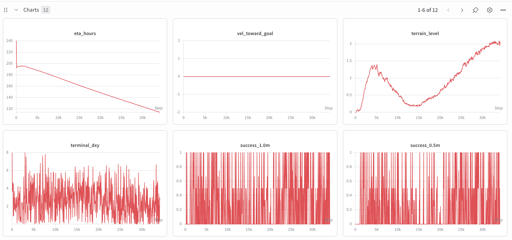
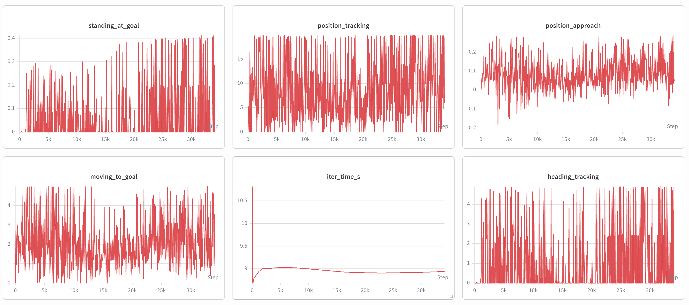

# AME-2

> Chong Zhang, Victor Klemm, Fan Yang, Marco Hutter (ETH Zurich RSL)
> *"AME-2: Agile and Generalized Legged Locomotion via Attention-Based Neural Map Encoding"*
> [arXiv:2601.08485](https://arxiv.org/abs/2601.08485)

**Robots:** ANYmal-D (12-DoF quadruped) | PF_TRON1A (6-DoF biped)
**Sim:** Isaac Lab 0.46.x (Direct Workflow) + RSL-RL (PPO)
**Status:** Phase 1 Teacher training in progress

### Training Progress (ANYmal-D, 30K iterations)




---

## How It Works

```
Phase 0 ── Pretrain MappingNet (no sim, ~1hr GPU)
Phase 1 ── Teacher PPO (80K iters, Isaac Sim)     ← current
Phase 2 ── Student Distillation + PPO (40K iters)
```

**Teacher architecture:**
```
Height Map (31×51@4cm) → MappingNet (UNet) → Policy Map (14×36@8cm)
                                                      ↓
Proprioception (48D) → PropEncoder (128D) → Cross-Attention (16 heads)
                                                      ↓
                                           map_emb(192D) + prop_emb(128D)
                                                      ↓
                                              MLP → 12 joint targets
```

---

## Quick Start

### Prerequisites

- NVIDIA GPU (8x A100s, 80GB VRAM)
- Isaac Sim 5.0 + Isaac Lab 0.46.x
- Python 3.10, PyTorch 2.x

### Install

```bash
# 1. Install Isaac Lab (follow official docs)
# https://isaac-sim.github.io/IsaacLab/

# 2. Clone this repo
git clone https://github.com/Safe-Sentinel-Inc/locomotion_trainer.git
cd locomotion_trainer

# 3. Install network package
pip install -e .

# 4. Verify (no Isaac Sim needed)
pytest scripts/test_ame2.py -v   # 19 tests
```

### Train

```bash
# Single GPU training (RTX 3090, ~2048 envs max)
CUDA_VISIBLE_DEVICES=0 python scripts/train_ame2_direct.py \
    --num_envs 2048 --seed 42 --log_dir logs/gpu0 --headless

# Resume from checkpoint
CUDA_VISIBLE_DEVICES=0 python scripts/train_ame2_direct.py \
    --num_envs 2048 --seed 42 --log_dir logs/gpu0 \
    --resume logs/gpu0/model_800.pt --headless

# Multi-GPU: run separate processes on different GPUs
CUDA_VISIBLE_DEVICES=0 python scripts/train_ame2_direct.py --seed 42 --log_dir logs/gpu0 --headless &
CUDA_VISIBLE_DEVICES=1 python scripts/train_ame2_direct.py --seed 43 --log_dir logs/gpu1 --headless &
```

Checkpoints saved every 50 iterations to `log_dir/model_*.pt`.

### Distributed Training (Multi-GPU, gradient-synced)

Uses `torchrun` to launch one process per GPU. Each rank runs its own Isaac Sim instance, then parameters are averaged via NCCL `all_reduce` after each PPO update — matching the paper's training setup.

```bash
# 4 GPUs, 1200 envs each = 4800 total (paper spec)
PYTHONUNBUFFERED=1 torchrun --nproc_per_node=4 \
    --master_addr=127.0.0.1 --master_port=29500 \
    scripts/train_ame2_direct.py \
    --num_envs 1200 --seed 42 --log_dir logs/distributed --headless

# Resume from checkpoint
PYTHONUNBUFFERED=1 torchrun --nproc_per_node=4 \
    --master_addr=127.0.0.1 --master_port=29500 \
    scripts/train_ame2_direct.py \
    --num_envs 1200 --seed 42 --log_dir logs/distributed \
    --resume logs/distributed/model_2200.pt --headless

# Long-running (survives SSH disconnect)
PYTHONUNBUFFERED=1 nohup torchrun --nproc_per_node=4 \
    --master_addr=127.0.0.1 --master_port=29500 \
    scripts/train_ame2_direct.py \
    --num_envs 1200 --seed 42 --log_dir logs/distributed \
    --headless > logs/distributed/train.log 2>&1 &
```

**How it works:**

1. `torchrun` sets `WORLD_SIZE`, `RANK`, `LOCAL_RANK` env vars per process
2. Each rank sets `CUDA_VISIBLE_DEVICES=<LOCAL_RANK>` so Isaac Sim sees only 1 GPU
3. Each rank runs its own Isaac Sim + env + PPO independently
4. After each PPO update, `all_reduce(SUM) / world_size` averages parameters across ranks
5. Every 200 iterations, a sync check verifies all ranks have identical parameter checksums
6. Only rank 0 saves checkpoints and logs metrics

**Envs per GPU:**

| Envs/GPU | Total (4 GPU) | VRAM/GPU | Iters/hr | Wall-clock to 80K |
|----------|---------------|----------|----------|--------------------|
| 1200     | 4800          | ~20GB    | ~620     | ~5.2 days          |
| 2400     | 9600          | ~30GB    | ~360     | ~9 days            |
| 4800     | 19200         | ~50GB    | ~180     | ~18 days           |

1200/GPU matches the paper and gives fastest wall-clock to convergence.

**Verify sync** — look for `[Sync Check]` in the training log:
```
[Sync Check it 2400] param_sums=['-1429.9628', '-1429.9628', '-1429.9628', '-1429.9628'] → SYNCED
```

See [TRAINING_GUIDE.md](TRAINING_GUIDE.md) for full details, troubleshooting, and hardware recommendations.

### Record Video

```bash
CUDA_VISIBLE_DEVICES=0 python scripts/play_record.py \
    --checkpoint logs/gpu0/model_1000.pt \
    --num_envs 4 --num_steps 500 --headless --output record.mp4
```

### Deploy to Remote Server

```bash
# Upload code (server has no git)
scp -r locomotion_trainer/ user@server:/path/to/

# On server: install Isaac Lab, then
cd /path/to/locomotion_trainer
pip install -e .

# Start training with nohup (PYTHONUNBUFFERED=1 required for log output)
nohup bash -c 'CUDA_VISIBLE_DEVICES=0 PYTHONUNBUFFERED=1 python scripts/train_ame2_direct.py \
    --num_envs 2048 --headless --log_dir logs/gpu0' > train.log 2>&1 &
```

---

## Project Structure

```
ame2/                       # Network package (pip install -e .)
├── networks/
│   ├── ame2_model.py       # MappingNet, AME2Encoder, AME2Policy, Critic, LSIO
│   └── rslrl_wrapper.py    # RSL-RL wrapper: AME2ActorCritic

ame2_direct/                # Direct Workflow environment
├── config.py               # All hyperparameters (rewards, terminations, PPO)
├── env.py                  # DirectRLEnv (~960 lines)
└── wrapper.py              # RSL-RL compatible obs wrapper

scripts/
├── train_ame2_direct.py    # Training script (Phase 1)
├── play_record.py          # Video recording
├── train_mapping.py        # Phase 0: MappingNet pretraining
└── test_ame2.py            # Unit tests
```

---

## Citation

```bibtex
@article{zhang2025ame2,
  title   = {{AME-2}: Agile and Generalized Legged Locomotion via
              Attention-Based Neural Map Encoding},
  author  = {Zhang, Chong and Klemm, Victor and Yang, Fan and Hutter, Marco},
  year    = {2025},
  url     = {https://arxiv.org/abs/2601.08485}
}
```

## License

Apache-2.0
